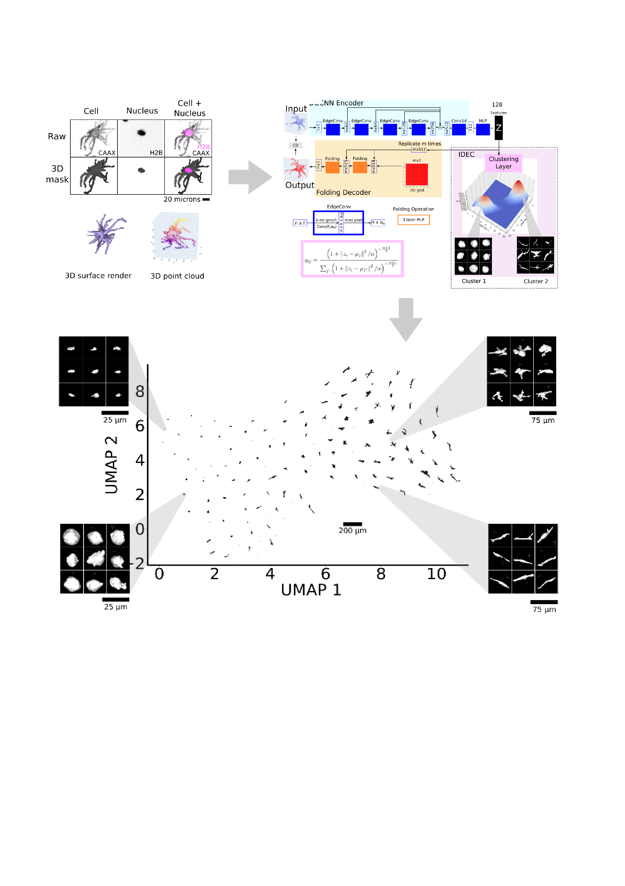

README
================
MDV and LGD
17/06/2022

<figure>
 
</figure>

## 3D single-cell shape analysis of cancer cells using geometric deep learning

This is a package for **automatically learning** and **clustering** cell
shapes from 3D images. Please refer to our preprint on bioRxiv [here](https://www.biorxiv.org/content/10.1101/2022.06.17.496550v1)

**cellshape** is available for everyone.

<https://github.com/Sentinal4D/cellshape-cloud> Cellshape-cloud is an
easy-to-use tool to analyse the shapes of cells using deep learning and,
in particular, graph-neural networks. The tool provides the ability to
train popular graph-based autoencoders on point cloud data of 2D and 3D
single cell masks as well as providing pre-trained networks for
inference.

<https://github.com/Sentinal4D/cellshape-cluster>

Cellshape-cluster is an easy-to-use tool to analyse the cluster cells by
their shape using deep learning and, in particular,
deep-embedded-clustering. The tool provides the ability to train popular
graph-based or convolutional autoencoders on point cloud or voxel data
of 3D single cell masks as well as providing pre-trained networks for
inference.

<https://github.com/Sentinal4D/cellshape-voxel>

Cellshape-voxel is an easy-to-use tool to analyse the shapes of cells
using deep learning and, in particular, 3D convolutional neural
networks. The tool provides the ability to train 3D convolutional
autoencoders on 3D single cell masks as well as providing pre-trained
networks for inference.

<https://github.com/Sentinal4D/cellshape-helper>

<figure>

</figure>
